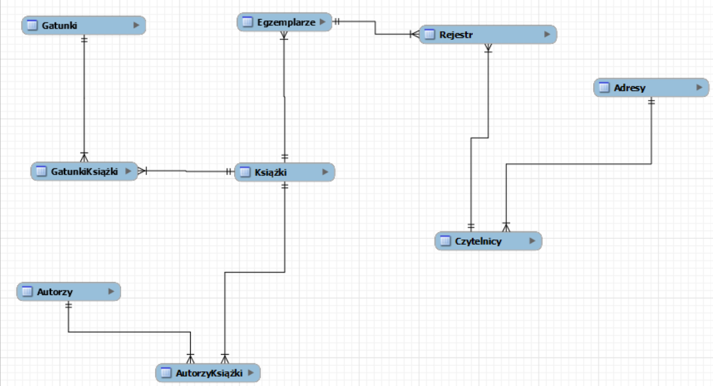

# Raport z bazy danych - Biblioteka

## Jan Moskal i Szymon Makulec

Wyniki etapu 1

| Czytelnicy     | Adresy                     | Rejestr | Egzemplarze | Książki              | Gatunki             | Autorzy       |
|-----------|-----------|-----------|-----------|-----------|-----------|-----------|
| Szymon Makulec | Lublin, ul.Nadbystrzycka 1 | \-      | \-          | Star Wars: Thrawn    | Science Fiction     | Timothy Zahn  |
| Szymon Makulec | Lublin, ul.Nadbystrzycka 1 | 1234    | 2           | Akademia Pana Kleksa | Przygodowa, Fantasy | Jan Brzechwa  |
| Jan Moskal     | Lublin ul. Tomasza Zana 10 | \-      | \-          | Lalka                | Powieść             | Bolesław Prus |

Wyniki etapu 2

| Nazwa związku          | Encje                | Liczności        |
|------------------------|----------------------|------------------|
| Autor Książki          | Książki, Autorzy     | Wiele do wielu   |
| Gatunek Książki        | Książki, Gatunki     | Wiele do wielu   |
| Egzemplarz Książki     | Książki, Egzemplarze | Jeden do wielu   |
| Egzemplarz w Rejestrze | Egzemplarze, Rejestr | Jeden do wielu   |
| Czytelnik w Rejestrze  | Rejestr, Czytelnicy  | Wiele do jednego |
| Adres Czytelnika       | Czytelnicy, Adresy   | Wiele do jednego |

Wyniki etapu 3

Wyniki etapu 5, 7

| Encja       | Atrybut          | Przykład             | Dziedzina atrybutu                                                                               |
|--------------|--------------|--------------|-------------------------------|
| Gatunek     | NazwaGatunku     | Dramat               | Lista gatunków (od 4 do 60 liter)                                                                |
| Autorzy     | Imie             | Adam                 | Imiona autorów książek (od 2 do 30 liter)                                                        |
| Autorzy     | Nazwisko         | Słowacki             | Nazwiska autorów książek (od 3 do 40 liter)                                                      |
| Książki     | Tytuł            | Pan Tadeusz          | Tytuły książek (od 2 do 100 liter)                                                               |
| Egzemplarze | NrEgzemplarza    | 2                    | Numery egzemplarzy danych książek (przedział od 1 do 100)                                        |
| Rejestr     | DataWypożyczenia | 2021-01-01           | Data wypożyczenia książki przez czytelnika (osiem cyfr i dwie - )                                |
| Rejestr     | DataOddania      | \-                   | Data oddania książki przez czytelnika, - dla nieokreślonych dat                                  |
| Czytelnicy  | Imie             | Janusz               | Imiona czytelników książek (od 2 do 30 liter)                                                    |
| Czytelnicy  | Nazwisko         | Kowalski             | Nazwiska czytelników książek (od 3 do 40 liter)                                                  |
| Czytelnicy  | Email            | example\@example.com | Email czytelnika, musi składać się z nazwy użytkownika, znaku \@, oraz domeny i jej rozszerzenia |
| Czytelnicy  | NrTelefonu       | 500100100            | Ciąg składający się z dokładnie 9 cyfr                                                           |
| Adresy      | Miejscowość      | Lublin               | Nazwiska autorów książek (od 3 do 40 liter)                                                      |
| Adresy      | Ulica            | Nadbystrzycka        | Nazwa ulicy (od 2 do 60 liter)                                                                   |
| Adresy      | NrMieszkania     | 20                   | Przedział od 1 do 1000                                                                           |
| Adresy      | NrLokalu         | 1                    | Przedział od 1 do 300                                                                            |
| Adresy      | KodPocztowy      | 20-510               | Ciąg składający się z 5 cyfr i jednego - między drugą, a trzecią literą                          |
|             |                  |                      |                                                                                                  |
|             |                  |                      |                                                                                                  |
|             |                  |                      |                                                                                                  |
|             |                  |                      |                                                                                                  |
|             |                  |                      |                                                                                                  |
|             |                  |                      |                                                                                                  |
|             |                  |                      |                                                                                                  |
|             |                  |                      |                                                                                                  |

Wyniki etapu 7
