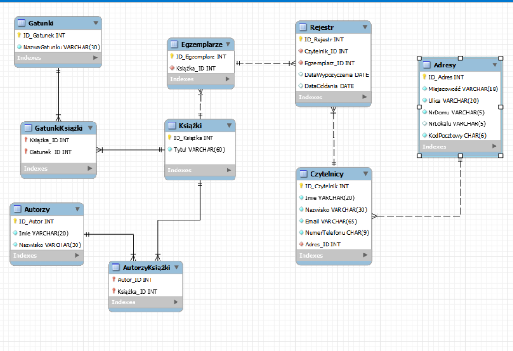

# Raport z bazy danych - Biblioteka

## Jan Moskal i Szymon Makulec

Wyniki etapu 1

+-----------------+----------------------------+------------------+-------------+----------------------+---------------------+---------------+
| Czytelnicy      | Adresy                     | Rejestr          | Egzemplarze | Książki              | Gatunki             | Autorzy       |
+=================+============================+==================+=============+======================+=====================+===============+
| Jan Kowalski    | Lublin, ul.Nadbystrzycka 1 | DW: "2024-01-02" | 1           | Star Wars: Thrawn    | Science Fiction     | Timothy Zahn  |
|                 |                            |                  |             |                      |                     |               |
|                 |                            | DO: "2024-01-16" |             |                      |                     |               |
+-----------------+----------------------------+------------------+-------------+----------------------+---------------------+---------------+
| Krzysztof Nowak | Lublin, ul.Nadbystrzycka 1 | DW: "2024-01-10" | 2           | Akademia Pana Kleksa | Przygodowa, Fantasy | Jan Brzechwa  |
|                 |                            |                  |             |                      |                     |               |
|                 |                            | DO: "2024-01-24" |             |                      |                     |               |
+-----------------+----------------------------+------------------+-------------+----------------------+---------------------+---------------+
| Bartosz Bąk     | Lublin ul. Tomasza Zana 10 | DW: NULL         | 1           | Lalka                | Powieść             | Bolesław Prus |
|                 |                            |                  |             |                      |                     |               |
|                 |                            | DO: NULL         |             |                      |                     |               |
+-----------------+----------------------------+------------------+-------------+----------------------+---------------------+---------------+

Wyniki etapu 2

| Nazwa związku          | Encje                | Liczności        |
|------------------------|----------------------|------------------|
| Autor Książki          | Książki, Autorzy     | Wiele do wielu   |
| Gatunek Książki        | Książki, Gatunki     | Wiele do wielu   |
| Egzemplarz Książki     | Książki, Egzemplarze | Jeden do wielu   |
| Egzemplarz w Rejestrze | Egzemplarze, Rejestr | Jeden do wielu   |
| Czytelnik w Rejestrze  | Rejestr, Czytelnicy  | Wiele do jednego |
| Adres Czytelnika       | Czytelnicy, Adresy   | Wiele do jednego |

Wyniki etapu 3

Wyniki etapu 5, 7

+------------+------------------+----------------------+--------------------------------------------------------------------------------------------------------------+
| Encja      | Atrybut          | Przykład             | Dziedzina atrybutu                                                                                           |
+============+==================+======================+==============================================================================================================+
| Gatunek    | NazwaGatunku     | Dramat               | Lista gatunków (od 4 do 30 liter)                                                                            |
+------------+------------------+----------------------+--------------------------------------------------------------------------------------------------------------+
| Autorzy    | Imie             | Adam                 | Imiona autorów książek (od 2 do 20 liter)                                                                    |
+------------+------------------+----------------------+--------------------------------------------------------------------------------------------------------------+
| Autorzy    | Nazwisko         | Słowacki             | Nazwiska autorów książek (od 3 do 30 liter)                                                                  |
+------------+------------------+----------------------+--------------------------------------------------------------------------------------------------------------+
| Książki    | Tytuł            | Pan Tadeusz          | Tytuły książek (od 2 do 60 liter)                                                                            |
+------------+------------------+----------------------+--------------------------------------------------------------------------------------------------------------+
| Rejestr    | DataWypożyczenia | 2021-01-01           | Data wypożyczenia książki przez czytelnika                                                                   |
+------------+------------------+----------------------+--------------------------------------------------------------------------------------------------------------+
| Rejestr    | DataOddania      | 2021-02-01           | Data oddania książki przez czytelnika                                                                        |
+------------+------------------+----------------------+--------------------------------------------------------------------------------------------------------------+
| Czytelnicy | Imie             | Janusz               | Imiona czytelników książek (od 2 do 20 liter)                                                                |
+------------+------------------+----------------------+--------------------------------------------------------------------------------------------------------------+
| Czytelnicy | Nazwisko         | Kowalski             | Nazwiska czytelników książek (od 3 do 30 liter)                                                              |
+------------+------------------+----------------------+--------------------------------------------------------------------------------------------------------------+
| Czytelnicy | Email            | example\@example.com | Email czytelnika, musi składać się z nazwy użytkownika, znaku \@, oraz domeny i jej rozszerzenia - 65 znaków |
+------------+------------------+----------------------+--------------------------------------------------------------------------------------------------------------+
| Czytelnicy | NrTelefonu       | 500100100            | Ciąg składający się z dokładnie 9 cyfr                                                                       |
+------------+------------------+----------------------+--------------------------------------------------------------------------------------------------------------+
| Adresy     | Miejscowość      | Lublin               | Nazwa miasta (od 3 do 18 liter)                                                                              |
+------------+------------------+----------------------+--------------------------------------------------------------------------------------------------------------+
| Adresy     | Ulica            | Nadbystrzycka        | Nazwa ulicy (od 3 do 20 liter)                                                                               |
+------------+------------------+----------------------+--------------------------------------------------------------------------------------------------------------+
| Adresy     | NrDomu           | 1234A                | Ciąg znaków (od 1 do 5)                                                                                      |
+------------+------------------+----------------------+--------------------------------------------------------------------------------------------------------------+
| Adresy     | NrLokalu         | 1234B                | Ciąg znaków (od 1 do 5)                                                                                      |
+------------+------------------+----------------------+--------------------------------------------------------------------------------------------------------------+
| Adresy     | KodPocztowy      | 20-510               | Ciąg składający się z 5 cyfr i jednego - między drugą, a trzecią literą                                      |
+------------+------------------+----------------------+--------------------------------------------------------------------------------------------------------------+

Wyniki etapu 9,10

## Wyświetlanie

### Tworzymy perspektywe w której mamy połączone AutorKsiążki i GatunkiKsiążki

CREATE VIEW AutorzyKsiążki_GatunkiKsiążki AS SELECT ak.Książka_ID, Gatunek_ID, Autor_ID FROM AutorzyKsiążki AS ak, GatunkiKsiążki AS gk WHERE gk.Książka_ID = ak.Książka_ID;

### Następnie dołączamy tabele Książki, Gatunki, Autorzy, w ten sposób czytelnik może przeglądać książki dostępne w bibliotece

SELECT Tytuł, Imie, Nazwisko, NazwaGatunku as Gatunek FROM AutorzyKsiążki_GatunkiKsiążki AS ak_gk, Książki, Autorzy, Gatunki WHERE Książki.ID_Książka = ak_gk.Książka_ID AND Gatunki.ID_Gatunek = ak_gk.Gatunek_ID AND Autorzy.ID_Autor = ak_gk.Autor_ID;

### Liczba dostępnych egzemplarzy dla danych książek

SELECT Tytuł, COUNT(ID_Egzemplarz) AS 'Liczba dostępnych egzemplarzy' FROM Książki JOIN Egzemplarze ON Egzemplarze.Książka_ID = Książki.ID_Książka WHERE (ID_Egzemplarz NOT IN (SELECT ID_Egzemplarz FROM Egzemplarze CROSS JOIN Rejestr ON Egzemplarze.ID_Egzemplarz = Rejestr.Egzemplarz_ID WHERE DataOddania IS NOT NULL)) GROUP BY Tytuł ORDER BY COUNT(ID_Egzemplarz) ASC;

## Możliwość rezerwacji (bliotekarz wypełnia rejestry, jeśli nie ma egzemplarzy danej książki to ją tylko rezerwuje)

### Wypożyczenie książki

INSERT INTO Rejestr VALUES (101,50, 6, '2025-01-17', '2025-01-31'); \### Rezerwacja książki INSERT INTO Rejestr VALUES (102,49, 6);

## Ograniczenia

INSERT INTO Rejestr VALUES (100,50, 6, '2024-01-17', '2024-01-31'); ERROR 1644 (45000): Ta książka jest aktualnie w posiadaniu kogoś innego

## Zapytania istotne z punktu widzenia specyfikacji danej bazy

### Bibliotekarz najpierw wyszukuje w Gatunki ID_Gatunek, którego szuka czytelnik

SELECT ID_Gatunek, Gatunek FROM Gatunki;

### Następnie wyszukuje książki danego gatunku po Gatunek_ID

DELIMITER // CREATE PROCEDURE KsiążkiPoGatunku(IN parametr_gatunku INT) BEGIN SELECT Tytuł, Imie, Nazwisko, NazwaGatunku as Gatunek FROM AutorzyKsiążki_GatunkiKsiążki AS ak_gk JOIN Książki ON Książki.ID_Książka = ak_gk.Książka_ID JOIN Autorzy ON Autorzy.ID_Autor = ak_gk.Autor_ID JOIN Gatunki ON Gatunki.ID_Gatunek = ak_gk.Gatunek_ID WHERE Gatunek_ID = parametr_gatunku; END // DELIMITER; CALL KsiążkiPoGatunku(7);

### Bibliotekarz najpierw wyszukuje w Autorzy ID_Autor, którego szuka czytelnik

SELECT ID_Autor, Imie, Nazwisko FROM Autorzy;

### Następnie wyszukuje książki danego autora po Autor_ID

DELIMITER // CREATE PROCEDURE KsiążkiPoAutorze(IN parametr_autor INT) BEGIN SELECT Tytuł, Imie, Nazwisko, NazwaGatunku as Gatunek FROM AutorzyKsiążki_GatunkiKsiążki AS ak_gk JOIN Książki ON Książki.ID_Książka = ak_gk.Książka_ID JOIN Autorzy ON Autorzy.ID_Autor = ak_gk.Autor_ID JOIN Gatunki ON Gatunki.ID_Gatunek = ak_gk.Gatunek_ID WHERE Autor_ID = parametr_autor; END // DELIMITER ; CALL KsiążkiPoAutorze(7);

## Najpierw sprawdza w czytelnikach z kim ma do czynienia

SELECT ID_Czytlenik, Imie, Nazwisko FROM Czytelnicy;

## Następnie wyszukuje liste książek wypożyczonych przez danego użytkownika po Czytelnik_ID

DELIMITER // CREATE PROCEDURE WypożyczoneEgzemplarzeUżytkownika(IN parametr_id INT) BEGIN SELECT Czytelnik_ID, Egzemplarz_ID AS 'Nr. wypożyczonego egzemplarza',DataWypożyczenia,DataOddania FROM Egzemplarze LEFT JOIN Rejestr ON Egzemplarze.ID_Egzemplarz = Rejestr.Egzemplarz_ID WHERE DataOddania IS NOT NULL AND Czytelnik_ID = parametr_id; END // DELIMITER ; CALL WypożyczoneEgzemplarzeUżytkownika(7);

### Wyświetlanie wszystkich dostępnych egzemplarzy

SELECT ID_Egzemplarz AS 'Nr. wypożyczonego egzemplarza', Tytuł FROM Książki JOIN Egzemplarze ON Książki.ID_Książka = Egzemplarze.Książka_ID WHERE (ID_Egzemplarz NOT IN (SELECT ID_Egzemplarz FROM Egzemplarze CROSS JOIN Rejestr ON Egzemplarze.ID_Egzemplarz = Rejestr.Egzemplarz_ID WHERE DataOddania IS NOT NULL));

### Wszytskie wypożyczenia i rezerwacje w Rejestrze

SELECT Imie, Nazwisko, Tytuł, Egzemplarz_ID, DataWypożyczenia, DataOddania FROM (SELECT \* FROM Książki, Egzemplarze, Rejestr, Czytelnicy WHERE Egzemplarze.Książka_ID = Książki.ID_Książka AND Egzemplarze.ID_Egzemplarz = Rejestr.Egzemplarz_ID AND Rejestr.Czytelnik_ID = Czytelnicy.ID_Czytelnik) AS rkc;

### Książki, które muszą być oddane po jakiejś dacie
SELECT e.ID_Egzemplarz AS 'Numer egzemplarza', k.Tytuł, MAX(r.DataOddania) AS 'DataOddania'
FROM Egzemplarze e
JOIN Książki k ON e.Książka_ID = k.ID_Książka
JOIN Rejestr r ON e.ID_Egzemplarz = r.Egzemplarz_ID
WHERE e.ID_Egzemplarz IN (
    SELECT Egzemplarz_ID
    FROM Rejestr
    WHERE DataOddania > '2024-01-29'
)
GROUP BY e.ID_Egzemplarz, k.Tytuł
ORDER BY MAX(r.DataOddania);

